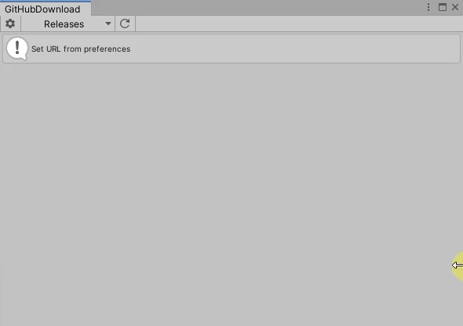
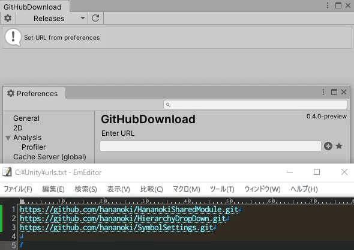

# GitHubDownload


[Japanese](https://translate.google.com/translate?sl=en&tl=ja&u=https://github.com/hananoki/GitHubDownload) (by Google Translate)

## Overview
- You can handle packages released on `GitHub Release` by operations on Unity.
- `.unitypackage` can be imported with a button.
- Git URL can be registered from preferences.



- You can read the URL list from a file



## Installation

Can be installed in any way

### Install Unity Package Manager

Add following lines to the `dependencies` section of the `Packages/manifest.json`.
```json
"dependencies": {
  "com.hananoki.github-download": "https://github.com/hananoki/GitHubDownload.git"
}
```

### Install `.unitypackage`

Download a `.unitypackage` file from the [Release page](https://github.com/hananoki/GitHubDownload/releases).

